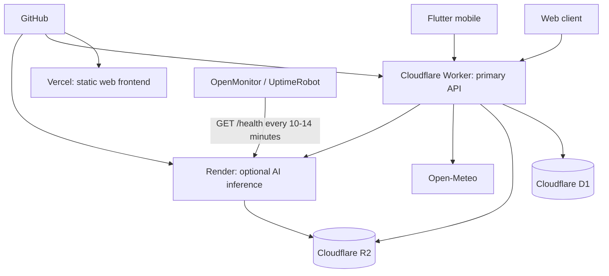

# Zero-Cost Cloud Architecture

## Runtime ownership

The Worker remains the system of record and the only service allowed to query
D1. Render is an optional compute service: an outage or cold start must not
prevent authentication, soil lookup, weather, farm management, or market data.

## Local layout

- `frontend/web`: static Vercel frontend (legacy API calls still need migration)
- `apps/worker-api`: Cloudflare Worker, D1 migrations, and R2 integration
- `apps/ai-service`: minimal Render FastAPI service
- `database`: legacy SQLite/PostgreSQL assets retained only during migration

## Provisioning order

1. Create the D1 database and replace `REPLACE_WITH_D1_DATABASE_ID` in
   `apps/worker-api/wrangler.jsonc`.
2. Create the `smart-farming-uploads` R2 bucket.
3. Set `JWT_SECRET` and `AI_SERVICE_TOKEN` using Wrangler secrets.
4. Apply D1 migrations from `apps/worker-api`.
5. Deploy the Render blueprint at repository root and set its `SERVICE_TOKEN`
   to the same value as the Worker's `AI_SERVICE_TOKEN`.
6. Deploy the Worker, then place its URL in the frontend configuration.
7. Link `frontend/web` as the Vercel project root and deploy the static frontend.
8. Monitor only Render's `/health`; never use an endpoint that queries D1, R2,
   or loads a model as the keep-alive target.

## Secrets

Never commit D1 IDs that are considered private, API tokens, JWT secrets, R2
credentials, or Render service tokens. The browser must never receive any of
these values. Only the Worker may access D1 and R2 bindings.

## Current migration boundary

The new infrastructure is additive. The existing Node and FastAPI services have
not been removed because the existing web pages still call their legacy routes.
Those calls must be migrated feature-by-feature before the legacy servers can be
retired.
